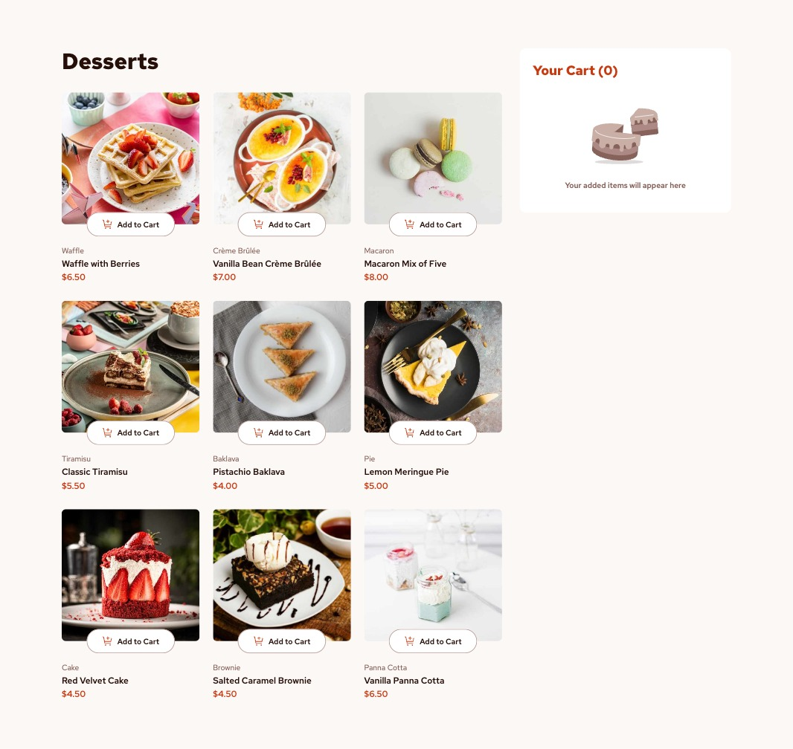
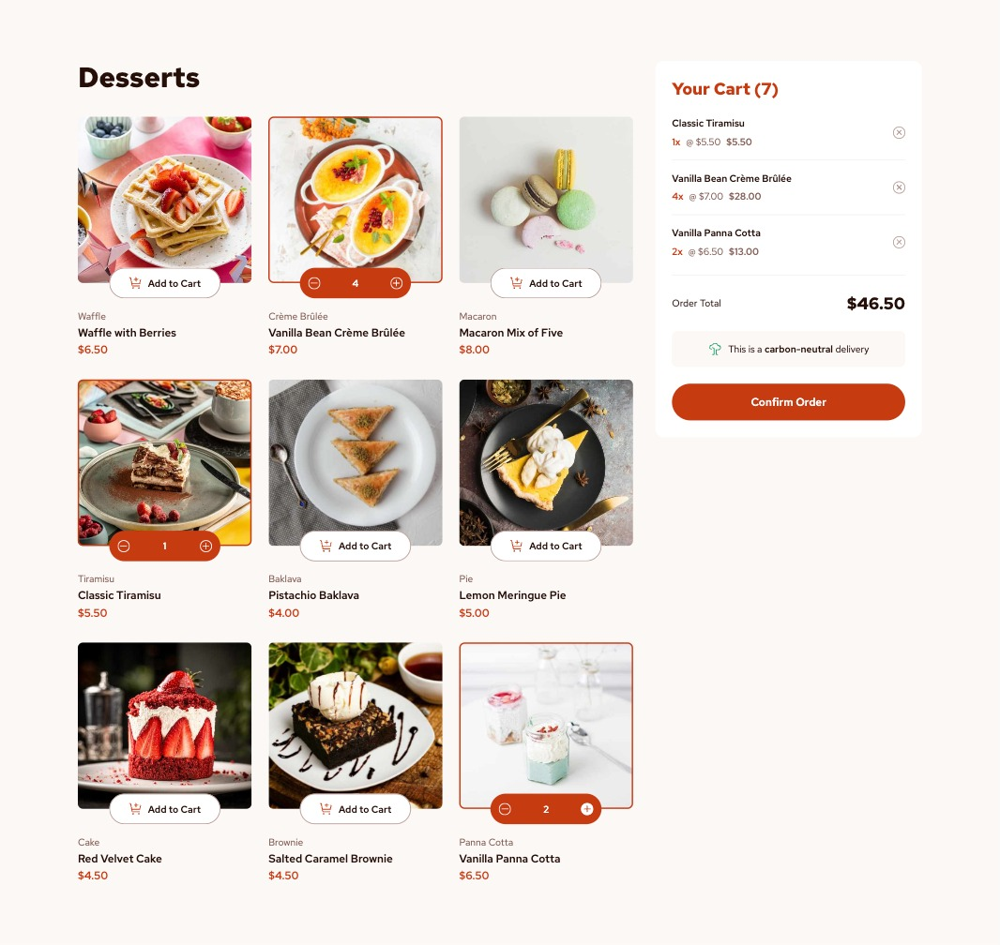

# Frontend Mentor - Product list with cart solution

This is a solution to the [Product list with cart challenge on Frontend Mentor](https://www.frontendmentor.io/challenges/product-list-with-cart-5MmqLVAp_d). Frontend Mentor challenges help you improve your coding skills by building realistic projects.

## Table of contents

- [Overview](#overview)
  - [The challenge](#the-challenge)
  - [Screenshots](#screenshots)
  - [Links](#links)
- [Built with](#built-with)
- [Author](#author)

## Overview

### The challenge

The challenge is to build out this product list project that includes a functional cart and get it looking as close to the design as possible.

Users should be able to:

- Add items to the cart and remove them
- Increase/decrease the number of items in the cart
- See an order confirmation modal when they click "Confirm Order"
- Reset their selections when they click "Start New Order"
- View the optimal layout for the interface depending on their device's screen size
- See hover and focus states for all interactive elements on the page

### Screenshots

### Links

- Solution URL: [https://github.com/FerdinandoGeografo/product-list-with-cart](https://github.com/FerdinandoGeografo/product-list-with-cart)
- Live Site URL: [https://products-with-cart-fg.netlify.app/](https://products-with-cart-fg.netlify.app/)

## Built with

- Semantic HTML5 markup
- SASS following 7-1 pattern and BEM conventions
- Flexbox
- CSS Grid
- Desktop-first workflow
- [Angular v18](https://angular.dev/) - JS Framework

## Author

- Frontend Mentor - [@FerdinandoGeografo](https://www.frontendmentor.io/profile/FerdinandoGeografo)
- LinkedIn - [@FerdinandoGeografo](https://www.linkedin.com/in/ferdinandogeografo/)
- GitHub - [@FerdinandoGeografo](https://github.com/FerdinandoGeografo/)
